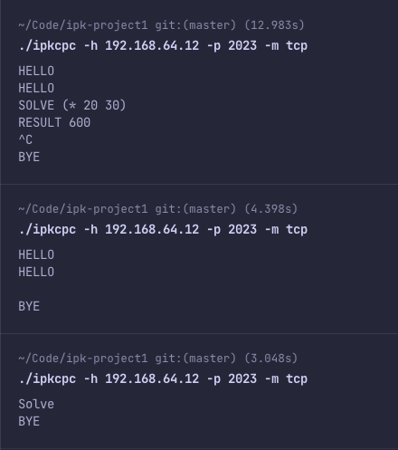
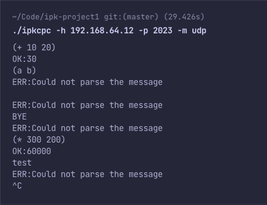

# IPK Project 1 - TCP/UDP Client
Author: Šimon Benčík, xbenci01

## Intro
The goal of project was to create a cli client that allows communication with server in TCP and UDP protocol. This documentation provides details of the project such as implementation, design and testing.

## Theory
TCP (Transmission Control Protocol) and UDP (User Datagram Protocol) are protocols used in network communication, which both work on layer 4 of the OSI model. TCP provides reliable communication, that requires connection. On the other hand, UDP is conectionless, less reliable but requires less moderation, which results in faster communication. While it you may question purpose of UDP, it is largely used in video streaming or online gaming.

## Design
The client is written in C++ and uses socket programming. It is split into a main entry file ipkcpc.cpp and one module called protocols which includes functions for handling communication for each protocol respectivelly. The main file's purpose is parsing arguments and preparation of socket.

## Implementation
The application uses standard socket library. After parsing arguments, which can be in any order, a hostname is checked for it's correctness. Followed by creating and assigning base data to structure for handling provided access. The last step of preparation is creating the socket. Depending on the selected mode, either **handleTCP** or **handleUDP** function is called. Both of these function sends and receive messages in format required by server with exception that TCP function also connects to server before sending messages. These functions also provide error handling at each step of communication. Last but not least, a signal handler was implemented for SIGINT (Control-C) to gracefully end the TCP connection and in both protocols close the socket. Support for Windows OS was not implemented, as the developer had no access to a machine running one. All of the implementation was done on macOs and tested on provided virtual environment.

## Testing
Testing was done manually during entire development. You can see sample results of the testing in images below.

<!--  -->
<table>
  <tr>
    <th> TCP </th>
    <th> UDP </th>
  </tr>
  <tr>
  <td>
  
  </td>
  <td>
  
  </td>
  </tr>
</table>

## Sources
- [IPK Projekty - Stubs](https://git.fit.vutbr.cz/NESFIT/IPK-Projekty/src/branch/master/Stubs)
- [Socket programming in C](https://www.geeksforgeeks.org/socket-programming-cc/)
- [A Simple Makefile Tutorial](https://www.cs.colby.edu/maxwell/courses/tutorials/maketutor/)
- [C++ Signal Handling](https://www.tutorialspoint.com/cplusplus/cpp_signal_handling.htm)